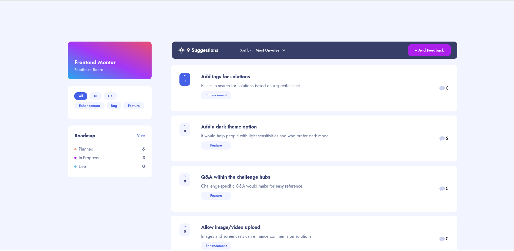

# Product Feedback App

This is a solution for a product feedback app, built using the MERN stack and styled with Tailwind CSS. The app allows users to manage feedback, upvote suggestions, and engage in discussions to improve product ideas and track progress.

## Table of Contents

- [Overview](#overview)
  - [Features](#features)
  - [Screenshot](#screenshot)
  - [Links](#links)
- [My Process](#my-process)
  - [Built With](#built-with)
  - [Learnings](#learnings)
  - [Continued Development](#continued-development)
  - [Resources](#resources)
- [Author](#author)

## Overview

### Features

Users can:

- **Add Post:** Create new posts to share ideas or feedback.
- **Edit Post:** Modify existing posts to update information or details.
- **Remove Post:** Delete posts that are no longer relevant or needed.
- **Comment:** Add comments to posts to provide feedback or engage in discussions.
- **Reply to Comments:** Reply to comments to continue conversations or address specific points.
- **Reply to Replies:** Comment on replies to further expand discussions or respond to feedback.
- **Select Different Statuses:** Choose from various statuses for ideas, such as "Under Review," "In Progress," or "Completed."
- **View in Roadmap Mode:** Visualize posts and their statuses in a roadmap mode to track progress and prioritize tasks.
- **Login and Register:** Authenticate users with login and registration functionality to access personalized features and maintain security.
- **Filter and Sort:** Filter posts based on categories or other criteria, and sort posts by most upvotes, most comments, or other relevant metrics.
- **Upvote:** Users can upvote posts to express agreement or support for particular ideas or feedback.

These features create an engaging platform for discussions, feedback management, and tracking ideas from conception to completion.

### Screenshot

### Links

- GitHub Repository: [https://github.com/TedJenkler/feedback-app-MERN-tailwind](https://github.com/TedJenkler/feedback-app-MERN-tailwind)
- Live Site: [https://feedback-app-mern-tailwind.onrender.com](https://feedback-app-mern-tailwind.onrender.com)

## My Process

### Built With

- **React** for building user interfaces
- **Tailwind CSS** for utility-first styling
- **Redux Toolkit** for state management
- **Node.js** and **Express.js** for backend API development
- **MongoDB** for database storage
- **Vite** as the frontend build tool
- **Flexbox** for responsive design and layout

### Learnings

During this project, I focused on:

- **Redux Toolkit:** Managing complex state efficiently.
- **Responsive Design:** Using Flexbox to ensure a consistent experience across different devices.
- **Form Handling and Validation:** Strengthening data integrity through robust validation techniques.
- **Node.js and Express.js:** Structuring scalable backend applications.
- **MongoDB:** Gaining hands-on experience with database management.
- **Animations:** Enhancing the user experience with smooth menu and element animations.
- **Testing:** Beginning to explore testing methodologies, though not fully implemented in this project.

### Continued Development

In the future, I aim to expand the app's functionality with:

- Full authentication to ensure only post owners can edit or delete their posts.
- A user dashboard for managing profiles and feedback submissions.
- Additional features for exploring projects and providing feedback across different areas.

### Resources

- [Redux Toolkit Documentation](https://redux-toolkit.js.org/)
- [Tailwind CSS Documentation](https://tailwindcss.com/docs)
- [React Router v6 Documentation](https://reactrouter.com/docs/en/v6/getting-started/introduction)
- [Stack Overflow](https://stackoverflow.com/)

## Author

- GitHub: [TedJenkler](https://github.com/TedJenkler)
- LinkedIn: [Teodor Jenkler](https://www.linkedin.com/in/tedjenklerwebdeveloper/)
